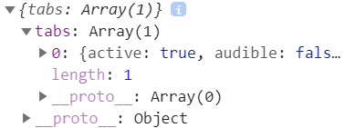

# workspace-api-for-chrome

[](https://badge.fury.io/js/workspace-api-for-chrome)

Provides workspace management capabilities for Chrome.

## How to use

Install the package:

```shell
npm add workspace-api-for-chrome
# or
yarn add workspace-api-for-chrome
```

## API

Import and initialize an instance (note that the creation of the window should be done separately and beforehand):

```typescript
import Workspace from 'workspace-api-for-chrome';
// suppose a window is created,
// and its id is stored in `windowId`
const workspace = new Workspace(windowId);
// also, if you want to enable logging
const workspace = new Workspace(windowId, true);
```

### read()

Read the workspace and return an object (compatible with *write()*).

```typescript
const data = await workspace.read();
```


#### Return Value

```typescript
type Data = {
  activeTabIndex: number;
  tabs: {
    url: string;
  }[];
};
```

### readRaw()

Read the workspace and return tabs in Chrome native format.

```typescript
const rawData = await workspace.readRaw();
```



#### Return Value

```typescript
type RawData = {
  tabs: chrome.tabs.Tab[];
};
```

### write()

Write the workspace and use minimal operations to make it align with the target state.

*Note:* if `activeTabIndex` is not provided, the active tab will remain the same; if `tabs` is not provided, the tabs
will not be synchronized.

```typescript
await workspace.write(data);
```

#### Parameter: *data*

```typescript
type OptionalData = {
  activeTabIndex?: number;
  tabs?: {
    url: string;
  }[];
};
```

### addEventListener()

Add callback function to handle events within the workspace.

```typescript
const callbackFn = (params) => {
  const { event, rawParams } = params;
  console.log(event, rawParams);
};
workspace.addEventHandler(callbackFn);
```

#### Parameter: *handlerToAdd*

```typescript
type EventHandler = (params: EventHandlerParams) => void;
```

*Note:* see [Type Definitions](#type-definitions) for detailed type definitions.

### removeEventHandler()

Remove callback function that handles events within the workspace.

```typescript
workspace.removeEventHandler(callbackFn);
```

#### Parameter: *handlerToRemove*

```typescript
type EventHandler = (params: EventHandlerParams) => void;
```

*Note:* see [Type Definitions](#type-definitions) for detailed type definitions.

### destroy()

Remove all internal listeners. Use it when you are ready to destroy the workspace instance.

```typescript
workspace.destroy();
```

## Type Definitions

```typescript
enum TabEvent {
  onActivated,
  onAttached,
  onCreated,
  onDetached,
  onHighlighted,
  onMoved,
  onRemoved,
  onUpdated,
}
```

```typescript
type EventHandlerParams =
  | {
      event: TabEvent.onActivated;
      rawParams: { activeInfo: chrome.tabs.TabActiveInfo };
    }
  | {
      event: TabEvent.onAttached;
      rawParams: { tabId: number; attachInfo: chrome.tabs.TabAttachInfo };
    }
  | {
      event: TabEvent.onCreated;
      rawParams: { tab: chrome.tabs.Tab };
    }
  | {
      event: TabEvent.onDetached;
      rawParams: { tabId: number; detachInfo: chrome.tabs.TabDetachInfo };
    }
  | {
      event: TabEvent.onHighlighted;
      rawParams: { highlightInfo: chrome.tabs.TabHighlightInfo };
    }
  | {
      event: TabEvent.onMoved;
      rawParams: { tabId: number; moveInfo: chrome.tabs.TabMoveInfo };
    }
  | {
      event: TabEvent.onRemoved;
      rawParams: { tabId: number; removeInfo: chrome.tabs.TabRemoveInfo };
    }
  | {
      event: TabEvent.onUpdated;
      rawParams: { tabId: number; changeInfo: chrome.tabs.TabChangeInfo; tab: chrome.tabs.Tab };
    };
```
